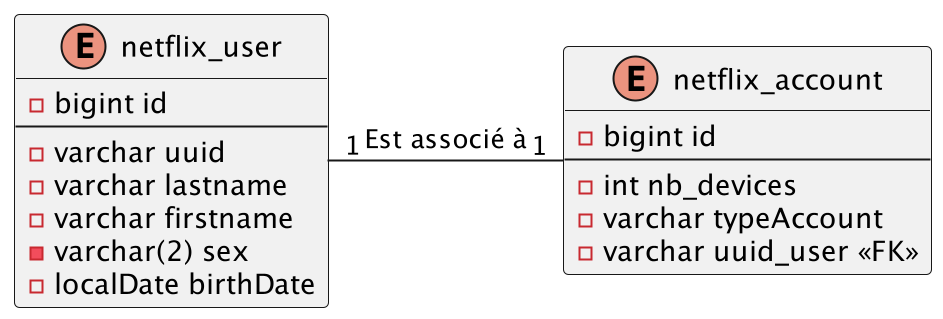
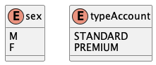
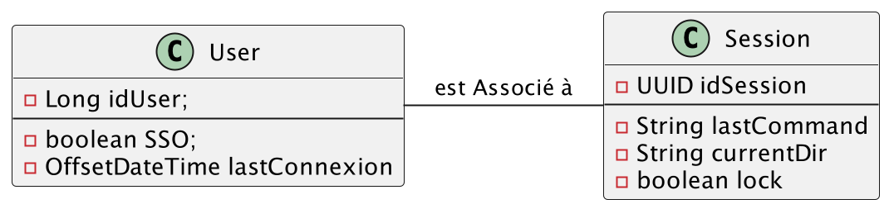

# <u>L3 Miage - BDD -TP1 - EXO2</u>

* Pour pouvoir démarrer tous les TP de manière simple, assurez-vous que vous avez tous les prérequis :
    * voir les [prérequis](prerequis.md)

# Objectif de l'exercice :

Dans cet exercice, vous allez devoir apprendre à :

* Apprendre la relation @OneToOne en bidirectionnel

# 1. @OneToOne dans le paradigme `validate`

1. Modéliser la en JPA en bidirectionnel ce qu'il y a en base :
    * En base de données il y a cette relation :
    * 
    * les entités auront pour nom `NetflixUserEntity` et `NetflixAccountEntity`
* `sex` et `typeAccount` sont des types enum :

    

# 2. @OneToOne dans le paradigme `create`

## Mapper ses 2 entités et leur relation

1. En premier temps, passez l'attribue `ddl-auto` dans le fichier [application.yml](server/src/main/resources/application.yml) à la valeur `create-drop`

2Modéliser la en JPA en bidirectionnel : 
* 

En ayant l'id de la classe `User` dans la table `Session`

---
# 
Fin de l'exo 2
 