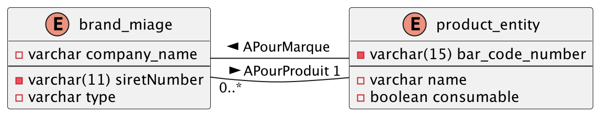
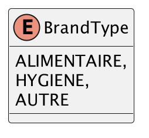
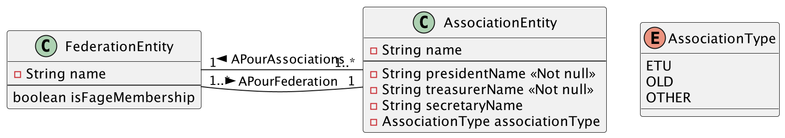

# <u>L3 Miage - BDD -TP1 - EXO1</u>

* Pour pouvoir démarrer tous les TP de manière simple, assurez-vous que vous avez tous les prérequis :
    * voir les [prérequis](prerequis.md)

# Objectif de l'exercice :

Dans cet exercice, vous allez devoir apprendre à :

* Créer des relations @ManyToOne / @OneToMany

## Dans le paradigme `validate`

1. Modéliser ses tables existantes en base, en JPA :
    *    
note : `BrandEntity` est un type enum de ce type : 
    * 

## Dans le mode `create`

1. faire passer l'attribue en mode create
2. Modéliser ces classes en JPA : 
    * 
* ⚠️ Aucune table d'association doit apparaitre.
---

# 
Fin de l'exo 3
